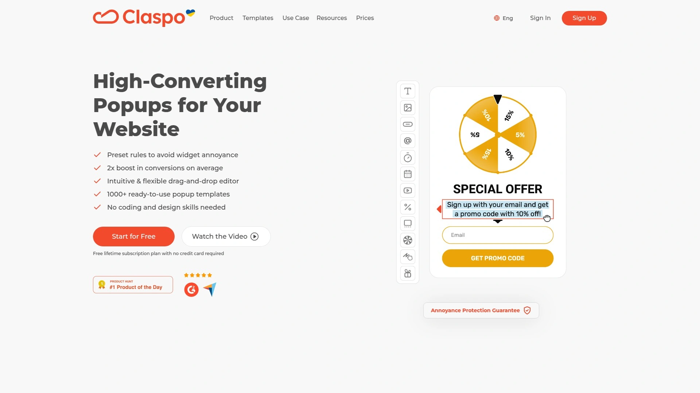
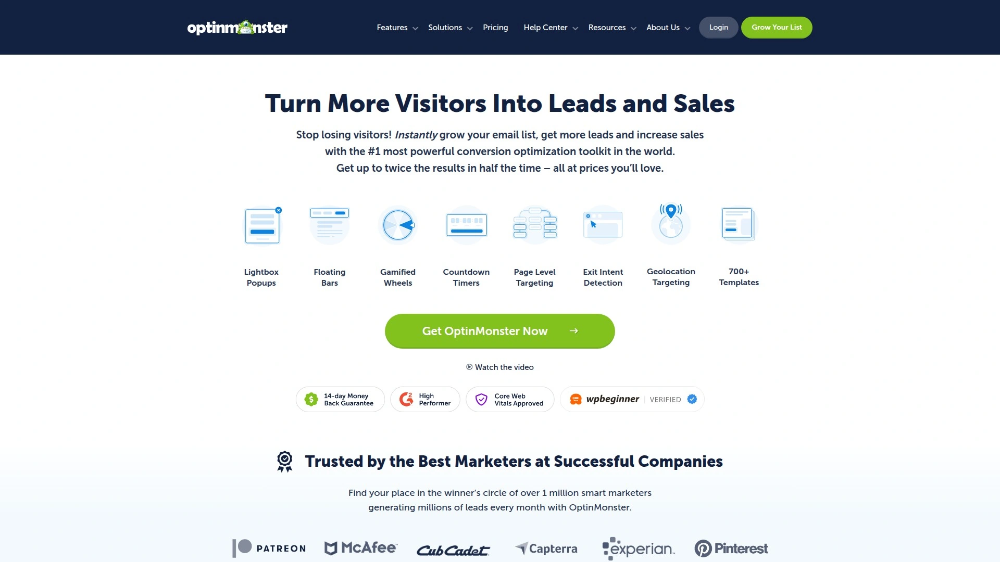
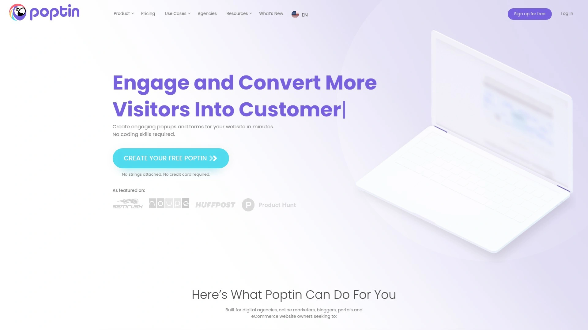
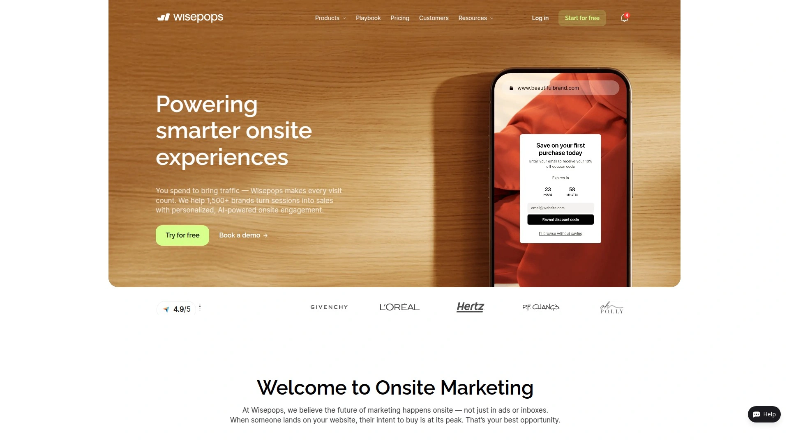
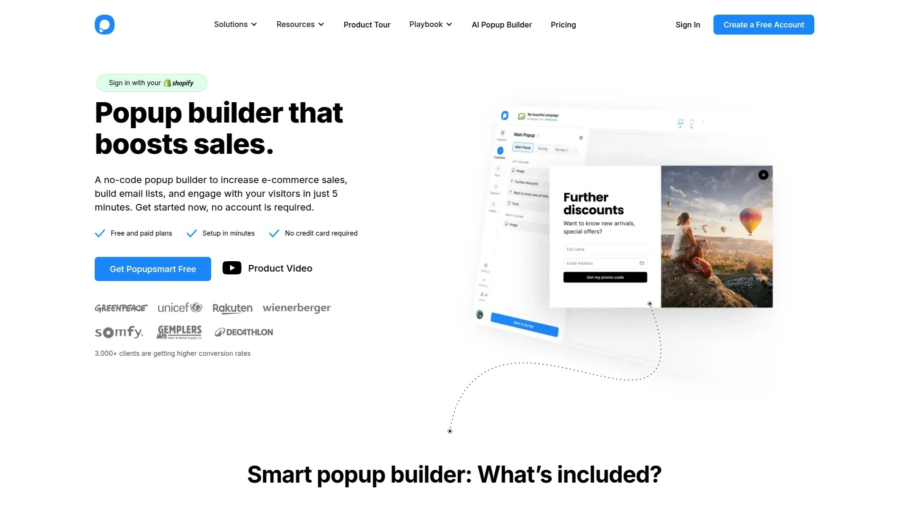
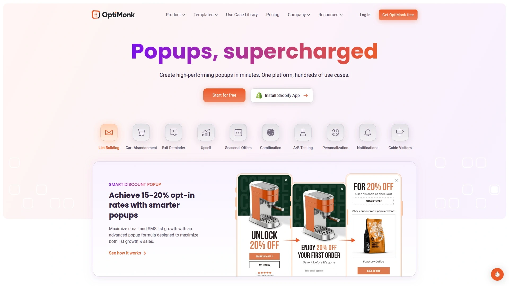
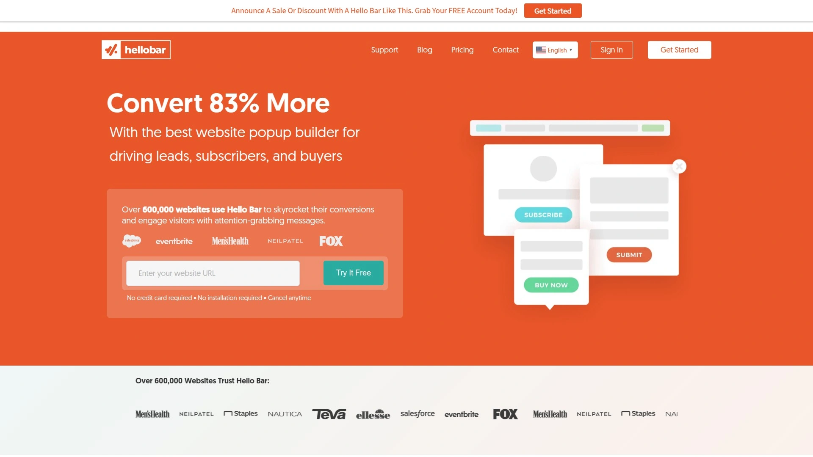
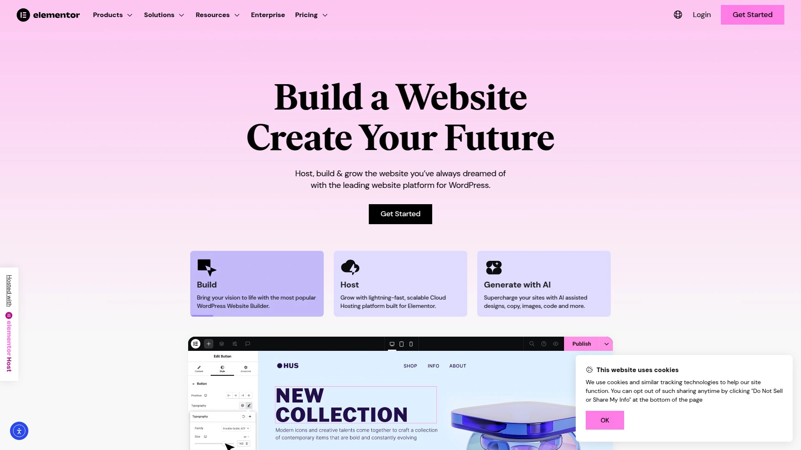
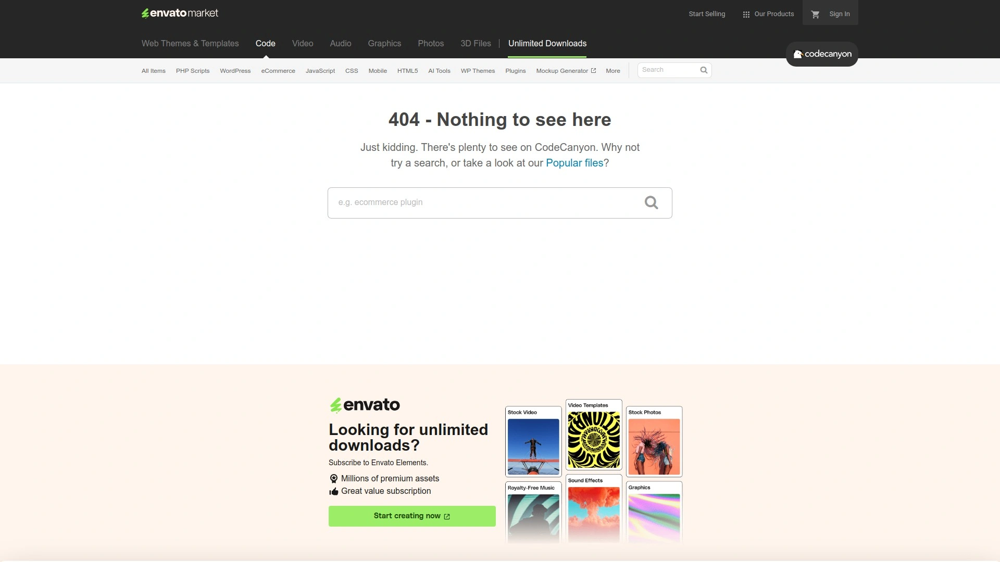
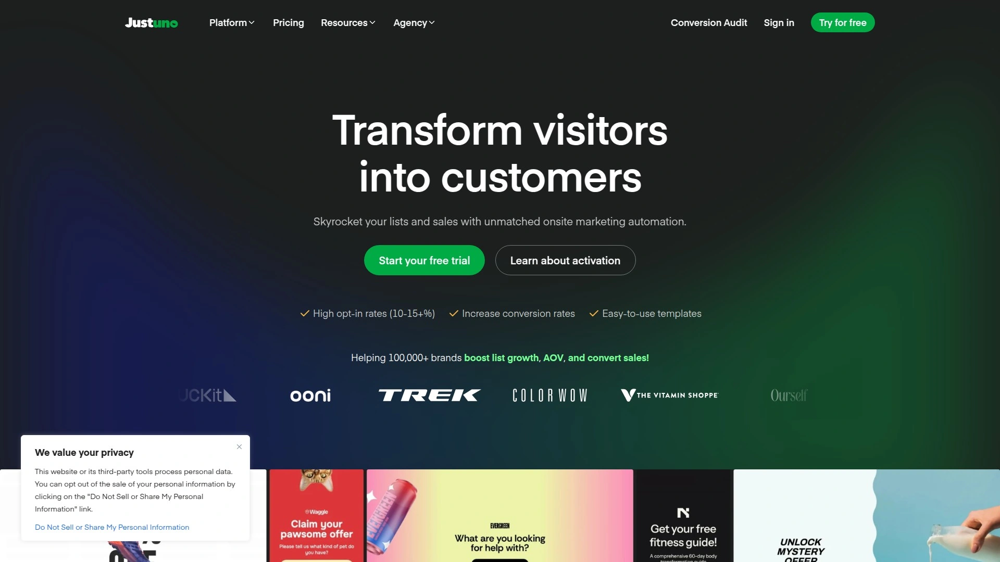

# 2025年排名前18的网站弹窗工具汇总(最新整理)

想提升网站转化率,但访客总在关键时刻离开?弹窗工具能在用户浏览、滚动或准备退出时精准触发,帮你捕获邮箱、减少购物车弃单、推送限时优惠。无论是电商网站降低流失率,还是内容站点增长订阅用户,合适的弹窗构建器能让转化效率翻倍。本文整理了18款经过实战验证的工具,覆盖免费方案到企业级解决方案,助你快速找到最适合自己业务场景的那一款。

***

## **[Claspo](https://claspo.io)**

零代码拖拽编辑器,800+模板库快速上手的全能型弹窗平台

Claspo提供直观的可视化编辑器,内置超过800个可定制模板,涵盖邮件收集、促销弹窗、游戏化转盘、退出意图拦截等多种场景。无需编程技能即可在几分钟内创建专业弹窗,支持灯箱、浮动栏、嵌入式小部件等6种展示类型。

平台的核心优势在于行为触发精准度和防打扰机制,预设规则自动避免过度展示,确保用户体验。内置A/B测试和实时分析功能,可直接追踪每个弹窗的转化表现并同步到Google Analytics。与WordPress、Shopify、Wix等主流建站平台无缝集成,同时支持700多种CDP、CRM和ESP系统对接。

**适用场景:** 中小型电商需要快速部署转化工具,内容营销团队想通过铅磁获取订阅用户,初创公司希望用免费方案测试市场反应。

**定价模式:** 提供永久免费计划,付费版包含更多高级功能和流量配额。

---

## **[OptinMonster](https://optinmonster.com)**

专注转化率优化的铅磁捕获工具,退出意图技术行业标杆

OptinMonster以其专有的退出意图检测技术闻名,能在访客鼠标移向关闭按钮的瞬间触发弹窗。平台提供26种以上的注意力动画效果和音效选项,搭配倒计时、内容锁定、滑入式滚动框等多样化弹窗类型。

地理位置定向功能允许根据访客所在地区推送本地化内容,结合行为自动化和收入归因分析,帮助营销人员精准追踪每个弹窗对实际销售的贡献。拖拽式构建器提供完整的自定义自由度,从消息文案到色彩字体都可一键调整。

**技术特点:** MonsterLinks和MonsterEffects功能可创建二次跟进活动,InactivitySensor检测用户闲置状态自动触发互动。

**起步价格:** 无免费版本,基础套餐从每月9美元起,按功能层级递增。

***

## **[Poptin](https://www.poptin.com)**

简洁易用的弹窗方案,游戏化元素提升互动乐趣

Poptin主打用户友好界面,新手能在极短时间内完成首个弹窗设置。提供游戏化弹窗模板如幸运转盘、刮刮卡,通过趣味机制吸引访客参与并设置奖品概率控制预算。弹窗类型包括灯箱、底部栏、滑入式、倒计时和全屏覆盖。

内置分析平台清晰呈现每个弹窗的表现数据,还能按设备类型(桌面/移动)单独追踪转化率。高级功能包含智能触发器、Cookie定向、可分享的Poptin链接和转化代码。与Google Analytics整合后可实现跨平台数据统一管理。

**推荐理由:** 界面布局直观,说明文档详尽,即便零经验也能快速上手。

**价格体系:** 提供免费入门计划,付费版从每月20美元起。

***

## **[Wisepops](https://wisepops.com)**

动态营销活动管理工具,Shopify店铺的理想搭档

Wisepops专为电商场景优化,提供购物车规则、产品推荐、限时折扣等针对性弹窗模板。平台强调动态内容个性化,可根据访客浏览历史、购物车状态、流量来源自动调整弹窗内容。

创建流程采用模块化设计,营销人员无需技术背景即可搭建复杂的多步骤活动。支持精细化受众分层,通过URL路径、设备类型、回访频次等多维度条件组合实现精准投放。A/B测试功能允许同时运行多个版本并实时优选胜者。

**适用对象:** 中大型电商网站需要高级个性化能力,营销团队希望快速验证假设并迭代策略。

**定价信息:** 按月访问量阶梯计费,具体价格需联系官方获取。

***

## **[Popupsmart](https://popupsmart.com)**

AI智能学习模式,自动优化弹窗展示时机

Popupsmart独特的"智能模式"通过人工智能分析用户行为至少一个月,随后自动在最佳时机向相关用户展示弹窗。提供500多个现代化预制模板,支持字体、颜色、布局、图片、视频、单选按钮等元素的深度定制。

平台在5分钟内即可完成从创建到发布的完整流程,无代码设计器降低技术门槛。免费方案支持多达5000次页面浏览和1个弹窗配置,适合小型网站测试效果。付费版本解锁高级定向、多弹窗并行和详细分析报告。

**核心卖点:** AI自动化减少手动调整工作量,让工具自己找到最优展示策略。

**价格梯度:** 免费方案可用,基础版24美元/月,专业版66美元/月,专家版108美元/月。

***

## **[BDOW! (前身为Sumo)](https://bdow.com)**

功能全面的免费工具,WordPress网站首选方案

BDOW!为WordPress用户提供完全免费的弹窗和表单解决方案,已被超过3万家在线企业采用。工具集成邮件营销功能,可直接在后台创建自动回复、发送内容升级资料。支持创建弹窗、滚动框、智能栏、欢迎垫、点击触发器和内嵌表单。

高级定向规则覆盖URL、页面类型、设备、来源渠道、访客行为、退出意图、Cookie参数等多个维度。一键设置A/B测试,控制每个变体的展示频次并快速选定优胜者。与WooCommerce深度整合,可创建独特优惠减少购物车弃单并提升客单价。

**性能提升:** 最新版本脚本速度提升35%以上,新增Webhooks、Flodesk、Mailerlite、Klaviyo等集成。

**费用说明:** 核心功能永久免费,高级套餐从每月39美元起。

***

## **[Picreel](https://www.picreel.com)**

退出意图拦截专家,承诺即时提升15-300%转化

Picreel专注于捕获即将流失的访客,通过实时追踪用户数字足迹和点击行为,在关键时刻展示最相关的优惠。提供100多个可定制模板,从背景图像到字体色彩都可无缝匹配网站主题。

平台的定向规则和触发选项数量超过竞品,能识别高价值细分受众并针对性投放。集成超过700种销售、营销、CMS、CRM和社交工具,确保潜在客户数据自动同步。A/B测试和高级分析功能帮助快速改进活动效果。

**独特承诺:** 官方保证用户将从现有流量中获得更多销售或潜在客户,否则30天内退款。

**起始价格:** 提供永久免费计划,付费版从9.99美元/月起。

***

## **[OptiMonk](https://www.optimonk.com)**

一体化CRO工具集,电商营销人员的得力助手

OptiMonk整合弹窗、网站个性化和A/B测试于一体,专为电商营销人员和代理机构打造快速且经济的转化优化方案。提供300多个精美的即用型模板,涵盖邮件收集、游戏化、产品推荐、购物车挽回、折扣发放、反馈调查和季节性促销等场景。

拖拽式编辑器支持零代码自定义,用户可从头创建弹窗或调整模板每个元素以匹配品牌美学。高级分层功能包括购物车规则、地理位置、流量来源、页面停留时间、网站总时长等多维度组合。实时A/B测试助力基于真实数据优化策略。

**流量限额:** 免费方案支持每月1万次页面浏览,付费套餐从29美元/月起。

**目标用户:** 寻求快速见效且负担得起的电商品牌和增长型代理商。

---

## **[Hello Bar](https://www.hellobar.com)**

顶部/底部通知栏专家,已服务60万+网站

Hello Bar以其标志性的顶部和底部通知栏设计闻名,同时支持弹窗、警报、滑块和页面接管等形式。工具能让用户在5-15分钟内完成脚本安装和首个弹窗发布,无需编程知识。

平台灵活性体现在目标设置上,可配置邮件订阅、购物车完成、页面跳转、电话号码收集、预约通话等多种行动召唤。与众多CMS平台和邮件服务商深度集成,简化数据流转。用户报告显示其转化率常匹配或超越传统弹窗,互动率比标准方案高出40%。

**部署便捷度:** 可为不同页面或访客群体设置无限数量的独立弹窗。

**价格区间:** 提供基础免费版,功能完整版需付费订阅。

***

## **[Thrive Leads](https://thrivethemes.com)**

WordPress营销套件组件,完整网站开发解决方案

Thrive Leads随Thrive Suite订阅提供,整合落地页构建器、选择表单、弹窗、通知栏等全套工具。拖拽式表单构建器支持智能定向工具和完全响应式设计。提供561个以上转化优化型专业模板,数量是同类工具的9倍以上。

A/B测试引擎允许实时对比标题、表单字段和文案效果,一键选定优胜方案。触发规则涵盖页面停留时间、滚动深度、退出意图、内容后位置、CSS元素后、点击事件等。可为单个表单添加退出意图作为附加条件,例如"10秒后或准备离开时"触发。

**定价模式:** 季度订阅30美元/月,年度订阅19美元/月。

**注意事项:** 如果更换页面构建器需继续付费才能保留弹窗活动。

***

## **[Convert Pro](https://convertpro.net)**

轻量高效的WordPress插件,移动端友好设计

Convert Pro主打革命性拖拽编辑器,为非技术用户提供完整设计自由度和实时预览功能。支持多种表单元素和格式选项,能创建符合网站主题和语境的精美选择表单。所有模板100%可定制,安装后即可按需编辑使用。

独立的移动端编辑器遵循Google标准,用户可单独控制移动设备上弹窗的每个细节,甚至从空白画布为移动端专门设计。提供在桌面/平板/移动设备上显示或隐藏弹窗的自由,有效避免Google惩罚。触发器包含页面访问次数和用户闲置检测等独特选项。

**规则灵活性:** 可创建多个规则集,每个规则集是"或"关系,集内条件是"且"关系,提供比竞品更强的组合能力。

**价格定位:** 比Thrive Leads更经济实惠的一次性购买方案。

---

## **[Elementor Pro](https://elementor.com)**

可视化页面构建器内置弹窗系统,设计师最爱

Elementor Pro的弹窗构建器允许用户利用数百个预制模板或从零开始创建。可选择模态灯箱、通知栏等不同位置类型,使用常规Elementor控件编辑内容和样式。弹窗可设置展示条件和触发器,包括页面加载、滚动、点击、退出意图等。

高级规则允许基于用户角色、设备类型、日期时间范围等因素精准控制显示。与Mailchimp等邮件服务无缝连接,通过API密钥绑定实现表单提交自动同步。适合已使用Elementor建站的用户,无需安装额外插件即可实现弹窗功能。

**设计自由度:** 拖拽编辑器提供顶级自定义能力,从消息到颜色图片字体都可调整。

**获取方式:** 包含在Elementor Pro订阅中,无需单独购买。

***

## **[Ninja Popups](https://codecanyon.net/item/ninja-popups-for-wordpress/)**

触发机制丰富的WordPress插件,转化率提升利器

Ninja Popups专为WordPress网站设计,提供多样化的触发选项有效提升转化率。插件与大多数主流邮件营销服务集成,简化潜在客户管理流程。支持创建标准灯箱弹窗、退出意图拦截、时间触发和滚动深度激活等类型。

安装和配置过程相对简单,WordPress用户能快速部署到现有网站。提供基础的自定义选项调整弹窗外观以匹配站点风格。虽然界面设计可能不如某些高端工具现代化,但功能稳定性获得用户认可。

**适用场景:** 预算有限但需要可靠弹窗功能的WordPress站长。

**购买模式:** CodeCanyon平台一次性购买,无月度订阅费用。

***

## **[Icegram](https://www.icegram.com)**

慷慨的免费版本,WordPress后台一体化管理

Icegram以直接且有效的方式为WordPress网站添加弹窗和行动栏,无需陡峭的学习曲线或高昂成本。所有操作在WordPress仪表板内完成,适合偏好统一环境的用户。提供弹窗、页眉/页脚行动栏、Toast通知、滑入信使等多种消息类型。

免费版本包含基于时间的触发器、特定页面定向、用户规则(首次访客vs已登录用户)等核心功能。升级高级计划后解锁退出意图触发、A/B测试和活动分析等高级能力。模板库帮助用户快速启动项目,界面相对简洁易懂。

**价格体系:** 免费版功能慷慨,专业版从每年97美元起(单站点授权)。

**局限性:** 关键优化工具如退出意图和A/B测试需付费解锁。

***

## **[Getsitecontrol](https://getsitecontrol.com)**

邮件营销完整工具集,弹窗表单一站式方案

Getsitecontrol整合邮件营销工具帮助收集和管理联系人、设置自动化邮件、发送新闻简报。同时可运行包含弹窗和表单的站内活动,用于促销优惠、挽回弃单、收集反馈、捕获邮箱地址。与Mailchimp和Shopify等平台无缝集成。

提供数十个精心设计的模板可直接使用或深度定制至完美匹配网站设计。高级表单构建器允许选择表单位置、配色方案、添加视觉元素和CSS样式,整个过程快速流畅。连接后所有表单收集的数据自动传递至Mailchimp等平台。

**分析优势:** 内置分析功能帮助确定哪种弹窗模板更有效,告别盲目猜测。

**定价结构:** 提供免费试用,具体付费方案需访问官网查询。

---

## **[Sleeknote](https://sleeknote.com)**

智能营销人员的弹窗构建器,用户友好度卓越

Sleeknote为希望在不耗费数小时情况下创建高转化弹窗的营销人员打造。平台强调简洁直观的操作流程,让用户专注于策略而非技术细节。提供多种弹窗类型包括电子邮件收集、游戏化、产品推荐、折扣发放等。

高级定向选项支持根据退出意图、购物车状态、滚动深度等条件触发。可与主流邮件服务提供商和电商平台集成,实现数据自动化流转。用户界面设计现代化,学习曲线平缓,即便初次使用也能快速掌握。

**用户反馈:** 有用户报告Sleeknote在早期版本存在小bug,但持续更新中不断改进。

**价格信息:** 无免费长期方案,提供免费试用,付费计划需联系销售获取报价。

***

## **[Justuno](https://www.justuno.com)**

Shopify商家常用选择,转化漏斗优化专家

Justuno在Shopify生态中具有较高知名度,为电商卖家提供弹窗和转化优化工具。平台支持创建智能弹窗活动,根据用户行为、产品浏览历史、购物车价值等因素动态调整内容。与Unbounce一起被用户推荐为成功的第三方弹窗应用。

提供详细的细分和定向功能,可针对新访客、回头客、高价值用户设置不同策略。A/B测试和转化分析帮助持续优化活动表现。适合已在Shopify建立店铺且寻求专业转化工具的商家。

**集成生态:** 与Klaviyo、Shopify、多种CRM系统兼容,数据打通顺畅。

**定价方式:** 按月订阅制,具体费用视店铺规模和功能需求而定。

***

## **[Unbounce](https://unbounce.com)**

落地页构建巨头,弹窗和粘性栏附加功能

Unbounce主要以落地页构建器著称,同时提供弹窗和粘性栏创建能力。拖拽式构建器加速落地页制作流程,几分钟内即可发布高转化弹窗和粘性栏。显示规则支持基于地理位置、引荐来源、Cookie等条件定向访客。

适合需要完整营销页面解决方案的团队,落地页和弹窗可统一管理。工具提供丰富的模板库和自定义选项,确保品牌一致性。与主流营销自动化和分析平台集成,便于追踪活动ROI。

**定位特点:** 更侧重落地页功能,弹窗作为补充工具存在。

**价格等级:** 属于中高端价位,适合有预算的中大型企业。

***

## **[Mailchimp表单](https://mailchimp.com)**

邮件营销平台原生弹窗,数据无缝同步

Mailchimp内置的弹窗表单工具允许用户直接在平台内创建并发布到网站。设计过程无需编码,可替换图像、添加logo、更改颜色和字体以匹配品牌形象。每个弹窗只能发布到一个网站,但可为不同站点创建多个弹窗。

触发器可设置为页面加载后指定秒数自动显示,也可配置高级定向规则控制展示频次和受众。由于原生集成,所有收集的邮箱自动添加到Mailchimp受众列表,无需手动导入。适合已使用Mailchimp进行邮件营销的团队,减少工具切换成本。

**适用前提:** 需要已有Mailchimp账户并连接网站(支持Shopify、自定义代码等)。

**费用包含:** 功能包含在Mailchimp订阅计划中,无需额外付费。

***

## 常见问题

**哪些弹窗工具提供完全免费的长期计划?**

BDOW!(前身Sumo)、Claspo、Picreel和Popupsmart都提供永久免费方案,其中BDOW!在WordPress生态中功能最全面,Claspo免费版包含800+模板和基础分析,Picreel免费计划支持5000访问量,Popupsmart免费版限制为5000页面浏览和1个弹窗。这些方案适合初创企业或小型网站测试弹窗效果后再决定是否升级。

**退出意图弹窗技术哪家最准确?**

OptinMonster的专有退出意图检测技术被业界视为标杆,能精准捕捉鼠标移动轨迹判断离开倾向。Picreel专注退出拦截场景并承诺显著提升转化率。OptiMonk和Poptin也提供可靠的退出意图功能,前者整合在CRO工具集中,后者界面更友好适合新手。选择时需考虑整体功能需求和预算平衡。

**WordPress网站应该选择哪款弹窗插件?**

如果预算紧张首选BDOW!(Sumo),完全免费且功能强大。需要丰富模板和游戏化功能可选Claspo,提供WordPress专用插件和800+模板。已使用Elementor建站的直接用Elementor Pro内置弹窗,无需额外插件。Convert Pro和Thrive Leads适合寻求高级定向和A/B测试的用户,前者性价比更高。Icegram的免费版慷慨但高级功能需付费。

***

## 结语

从免费方案到企业级平台,这18款弹窗工具各有所长。如果你需要零成本快速上手,**[Claspo](https://claspo.io)**的800+模板库和永久免费计划能让你在几分钟内部署首个高转化弹窗,无论是电商促销、邮件收集还是用户调研都能轻松应对。选对工具只是第一步,持续测试和优化才能让每个访客都成为潜在转化机会。
